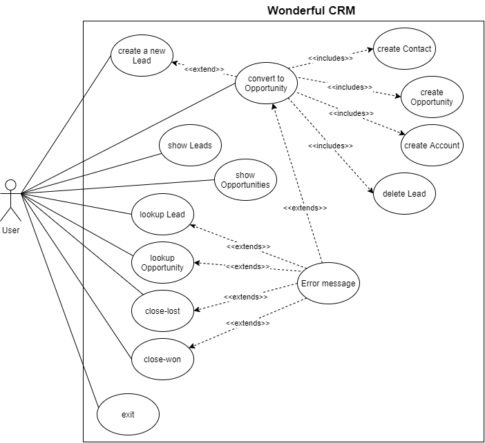
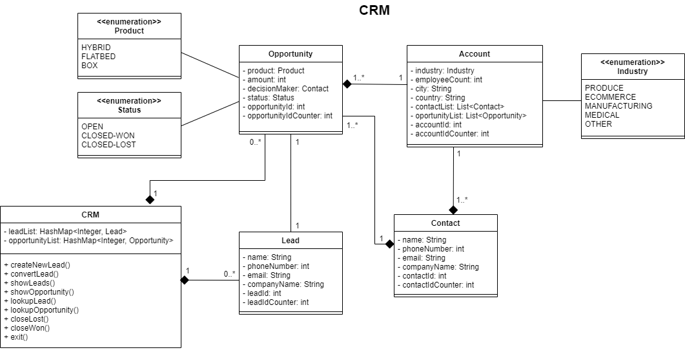

# WARNING
Since this is a maven project, we have found some incompatibilities when downloading it to a different PC. Our solution was the following:
- Open IntelliJ and go to File > Settings > Editor > Code Style > Java > Imports > UNCHECK use single class imports

If you still have problems, please contact us!

# OPP-Homework-Unit-2

Welcome to the best CRM in the world!

Before starting, we want to tell you how our project is organized.

We have created four principal classes (src/main/java/com/ironhack/classes/): 
* Lead: the person we want to pervert
* Contact: the contact information of the person we have perverted
* Opportunity: the information of what will we probably sell
* Account: the company of the person we have perverted

All of them contain an attribute "id" that autoincrements with every instance created. Also, a constructor and only getters, no setters: we didn't want our info to be edited after creation (except the Opportunity status)

Some of those classes' attributes were Enums, so we created them and added to the folder src/main/java/com/ironhack/enums/
* Industry
* Product
* Status

The principal methods have been written in three separated "utils" classes (src/main/java/com/ironhack/utils/):
* ScanInfo: these class methods ask the user for an individual input. You will find methods such as "askName", "askQuantity",...
* Checker: as their name say, these methods check that the user input is correct. Your name cannot contain numbers, sorry.
* Command: here we read the main commands of the program ("new lead", "show opportunities",...) and calls the appropiate method (newLead(), showOpportunities(),...) from the same class.
* Sound: well, this is not so important, it's just a class to make some sounds play. You can just ignore it if you want c:

And, of course, to execute our program, you have to go to the Main file. There we have created some hashmaps to store Leads and Opportunities (no Accounts nor Contacts for now). We have created two Leads and two Opportunities to help you test our program better (please be kind :D)

## Let's begin!

When you run our program, the following menu will appear:

    What do you want to do?:
    - new lead
    - convert \id\
    - show opportunities
    - show leads
    - lookup opportunity \id\
    - lookup lead \id\
    - close-lost \id\
    - close-won \id\
    - exit

Those are all the commands you can use, they are all case insensitive and were made error-proof. This menu will show until you type "exit" (or any phrase beggining with exit :P), and you command will be only read if this menu is the last thing printed in your console (take this into account since the commands that show phrases such as "New lead created", or many error messages, require you to hit ENTER before continuing). We have created two leads and two opportunities to make your testing easier :)

From this moment, the program works as requested by the OPP Homework. Remember that you cannot convert a Lead to Opportunity if it doesn't exists, and all of those obvious things. But don't worry, we have managed all exceptions so you can act as a dumb monkey if you want c: have fun!

## TDD

Yes, we also had to do some testing. We have to confess that this wasn't fun, but our program now is robust as a rock! (We can discuss if it was worth it later...)

The "Test" classes are inside src/test/java/com/ironhack/utils/:
* ScanInfoTest
* CheckerTest
* CommandTest

## Diagrams

### Use Case

### Class

